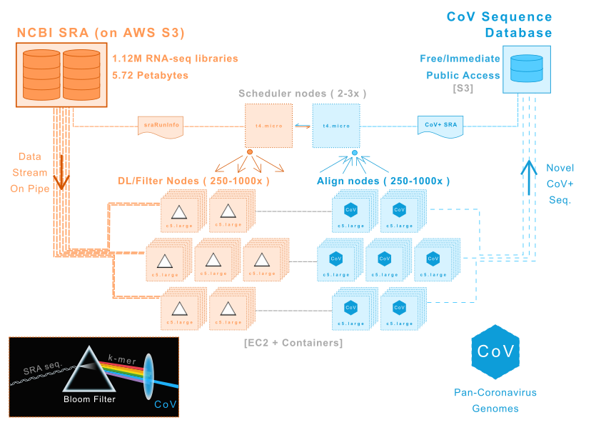

# serratus

AWS framework for cheap and fault-tolerant DNA/RNAs-seq alignment.

## Repo folders

**/ami**: Make scripts for instance images (ami) and their respective ami-id

**/img**: Diagrams of serratus workflows

**/scripts**: Defined units of work (jobs) performed in serratus

# Project S3
**s3://serratus-public/**

**$S3/resources**: Genome indices
- hgr1-bt2/ : human rDNA bowtie2 indexed

**$S3/example-data**: Toy data for testing
- bam/ : aligned bam files for breaking into blocks
- fq/  : sequencing reads of various length

## Useful links
- **S3 Bucket:** s3://serratus-public/ (public-readable)
- [Alpine Linux AMI](https://github.com/mcrute/alpine-ec2-ami)
- [AWS Batch workflow - Introduction](https://aws.amazon.com/blogs/compute/building-high-throughput-genomics-batch-workflows-on-aws-introduction-part-1-of-4/)
- [AWS Batch workflow - github](https://github.com/aws-samples/aws-batch-genomics)
- [FSx Shared file-system for HPC](https://aws.amazon.com/blogs/storage/using-amazon-fsx-for-lustre-for-genomics-workflows-on-aws/)
- [SRA in the Cloud -- Use SRA Toolkit](https://www.ncbi.nlm.nih.gov/sra/docs/sra-cloud/)
- [SRA Data Registry on S3](https://registry.opendata.aws/ncbi-sra/)
- [S3 transfer optimization](https://docs.aws.amazon.com/cli/latest/topic/s3-config.html)
- [Paper on analyzing EC2 costs (2011)](https://journals.plos.org/plosone/article?id=10.1371/journal.pone.0026624)
- [Pushing the limits of Amazon S3 Upload Performance](https://improve.dk/pushing-the-limits-of-amazon-s3-upload-performance/)
- [Clever SRA alignment pipeline](https://github.com/FredHutch/sra-pipeline
)
#### Architecture

# Getting up and running

## Building AMIs with Packer

First, [download Packer](https://packer.io/downloads.html).  It comes as a single
binary which you can just unzip.  I extracted it to `~/.local/bin` so that it ended
up on my PATH.

Next, use it to build the AMI: `/path/to/packer build serratus/packer/docker-ami.json`

This will start up a t3.nano, build the AMI, and then terminate it.  Currently this
takes about 2 minutes, which should cost well under a penny.

## Getting started with Terraform

Terraform currently uses state from a shared bucket.  This bucket location is
currently hardcoded due to a limitation with Terraform, and getting it going is
a bit challenging due to chicken-and-egg.

### The easy way (local state)

Go into stage/main.tf and comment out the "terraform" block (containing backend
information).  Terraform will store its state locally on your laptop hard drive.

## The hard way (shared state on S3)

You'll have to create the remote state with terraform before you can use it.  We'll
need to use local state to create the bucket and table, then move the state to the
newly created bucket.

 * Comment out the "terraform" block in tf-state/main.tf.
 * `cd serratus/tf-state` you have to be in a module directory to run terraform on it.
 * Run `tf init`.  Without a backend, terraform will create local state by default.
 * Run `tf apply`.  This will create the shared bucket and table.
 * Uncomment the "terraform" block from step 1.
 * Run `tf init` again.  Terraform if you want to copy state from "local" to "s3".  Answer "yes".
 * Run `tf apply` again.  This shouldn't do anything, but it should finish without errors if everything is setup correctly.

Note: since bucket names are hard-coded and universal, you will have to change the `serratus-tf-state` bucket name to something unique for your project, and repeat this elsewhere.

## Create infrastructure

 * `cd serratus/stage` to go to the staging area for the current release.
 * `tf init` you only need to run this once.
 * `tf apply` to create infrastructure.

